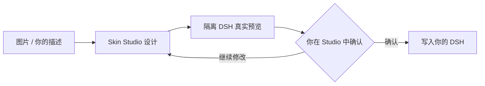

<div align="center">

# dsh-visual-skin

**DeepSeek Harness Skin Studio**

为 DeepSeek Harness（DSH）制作、预览并安全写入皮肤的本地可视化工作台。

[](https://github.com/deepseek-ai/deepseek-harness)


[](LICENSE)

<a href="docs/demo/out/hero-a-30fps.mp4"></a>

<sub>点击演示图播放 MP4 · [查看动画源文件](docs/demo/hero-a.html) · [查看分镜](docs/demo/storyboard.md)</sub>

</div>

---

## 先说结论

给一张图片，或直接在 Studio 里调色、调背景和区域效果；Skin Studio 会在**隔离的临时 DSH**中渲染结果。只有你在可见网页中审阅并确认后，主题才会写入本机 DSH。

| 你要做的事 | 得到什么 |
| --- | --- |
| 用图片做皮肤 | Agent Skill / MCP 自动创建设计、上传资产并打开预览 |
| 精细调整两块背景 | 侧边栏、主工作区、图片位置、遮罩和分隔线的即时预览 |
| 安全写入本机 DSH | 不可变计划、可见确认、可恢复的安装记录 |

## 10 秒看懂流程

<div align="center">
  <a href="docs/demo/out/build-b-30fps.mp4"></a>
</div>



> Agent 和 MCP 可以帮你完成设计与预览；**不能**伪造最后的写入确认。

## 功能一览

| 模块 | 做什么 | 为什么有用 |
| --- | --- | --- |
| **Skin Studio** | 图片、纯色、渐变；双区域背景；遮罩、玻璃拟态、token 调色与分隔线 | 所见即所得，不必手改配置文件 |
| **隔离预览** | 使用 Controller 管理的临时 DSH 实例，并复用 warm runner | 预览不触碰正在使用的 DSH，也减少重复启动负载 |
| **DSH 插件** | 常驻背景层、对话蒙版、侧边栏分隔与「皮肤设置」入口 | 切换对话后仍保持皮肤，不需要重新注入页面 |
| **Agent Skill** | 理解「换个皮肤」「用这张图做背景」等请求并编排流程 | DSH、Codex 等 agent 都能接入同一套设计能力 |
| **MCP Server** | `design_create`、`asset_upload`、`theme_patch`、`preview_start`、`theme_apply` 等工具 | 让 agent 有结构化、可审计的操作接口 |
| **安全写入** | 隔离预览回执 + 不可变 apply 计划 + 人工确认 | 写入前知道会改什么，失败时可恢复 |

## 安装

| 前置条件 | 版本 / 说明 |
| --- | --- |
| Windows | 10 或 11 |
| Node.js | 22+ |
| pnpm | 11+；首次构建便携运行时时需要 |
| DeepSeek Harness | `0.1.0-rc.6`；版本不匹配时插件会 fail-closed |

```powershell
git clone https://github.com/trrrrrryg/dsh-visual-skin.git
cd dsh-visual-skin
powershell -NoProfile -ExecutionPolicy Bypass -File .\install.ps1
```

安装器会构建便携运行时、安装 Skill、注册 DSH 插件与 MCP，并启动 Studio。默认不重启 DSH，避免打断正在进行的会话；完成后请自行重启一次 DSH。

<details>
<summary><b>常用安装参数</b></summary>

| 参数 | 作用 |
| --- | --- |
| `-DshHome <path>` | 指定 DSH 根目录，默认 `%USERPROFILE%\.dsh` |
| `-ProfileName <name>` | 指定 profile，默认 `web` |
| `-DataDir <path>` | Studio 数据目录 |
| `-ControllerPort <port>` | Studio Controller 端口，默认 `11862` |
| `-SkipBuild` | 复用已构建 runtime |
| `-SkipSkill` / `-SkipStudio` / `-SkipCodexMcp` | 跳过可选组件 |
| `-RestartDsh` | 安装后自动重启 DSH |

```powershell
.\install.ps1 -DshHome C:\Users\me\.dsh -ProfileName web -ControllerPort 12000 -RestartDsh
```
</details>

## 使用

### 在 Studio 中手动设计

1. 打开 `http://127.0.0.1:11862`，或从 DSH 的「设置 → 插件 → 皮肤设置」打开 Studio。
2. 上传图片，或调整背景、区域和 token，等待隔离预览就绪。
3. 点击 **写入我的 DSH**，审阅计划并亲自勾选确认；随后重启 DSH。

- 勾选整合两区域：背景会是一张随窗口缩放保持连续的画面。
- 取消勾选：可分别编辑侧边栏与主工作区，使用不同的颜色、渐变或图片。
- 所有变更先进入实时隔离预览；正式 DSH 在确认前不会被改动。

### 直接对 agent 说

- 「给我换个皮肤」
- 「用这张图片做背景」
- 「把现在的皮肤背景换掉」

Agent 会调用 `mcp__skin-studio__*` 完成设计与隔离预览，并把最终确认留在 Studio 网页中。

## 验证安装

```powershell
# DSH 插件健康检查（DSH 默认端口为 10402）
Invoke-RestMethod http://127.0.0.1:10402/dsh-skin/health

# Studio Controller 状态
Invoke-RestMethod http://127.0.0.1:11862/api/v1/status
```

## 开发

```powershell
pnpm install
pnpm build          # 构建全部包
pnpm test           # 回归测试；会启动真实 rc.6 隔离预览
pnpm controller     # 本地启动 Controller
pnpm dev            # Studio Vite 开发模式
```

<details>
<summary><b>目录说明</b></summary>

```text
apps/controller/       # API、隔离预览、apply/restore、GC
apps/studio/           # React + Vite Studio
packages/dsh-plugin/   # DSH host 路由与 client 皮肤渲染
packages/theme-schema/ # ThemeSpec v2 数据契约
packages/mcp-server/   # MCP stdio 服务
agents/codex-skill/    # 可安装 Agent Skill 与脚本
tests/                 # 含真实 rc.6 Chromium 隔离预览的回归测试
docs/demo/             # README 动画、分镜与导出脚本
docx/                  # 实施计划、需求分析、架构文档
```
</details>

## 安全与兼容

- ThemeSpec 只接受受控的颜色、内容寻址图片（sha256）和 token；不接收任意 CSS、JS 或 URL。
- 预览只在 Controller 拥有的临时 DSH 里运行；浏览器、MCP 和 agent 都拿不到写入确认凭据。
- 当前目标版本是 `0.1.0-rc.6`；不兼容时拒绝加载，而不是猜测性修改 DSH。

## 卸载

1. 从 `%DSH_HOME%\profiles\<profile>\cordis.patch.yml` 移除 `# >>> dsh-skin-studio` 到 `# <<< dsh-skin-studio` 之间的托管条目；
2. 删除 `%DSH_HOME%\profiles\node_modules\@dsh-skin` 和 `%DSH_HOME%\skills\deepseek-harness-skin-studio`；
3. 重启 DSH；如需清理 Studio 数据，再删除 `%LOCALAPPDATA%\DeepSeekHarnessSkinStudio`。

## 文档

- [变更记录](CHANGELOG.md)
- [发布清单](RELEASING.md)
- [项目文档](docx/)
- [MIT License](LICENSE)

---

MIT © 2026 trrrrrryg
